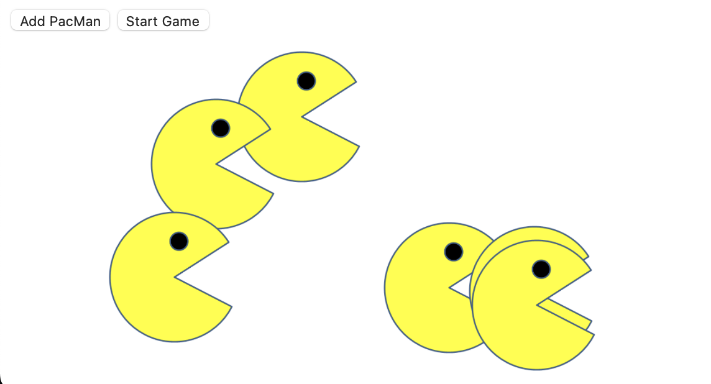

# PacMenFactory
PacMen Factory Game - Module 7

Simple PacMen Game: Interactive browser window game where a user can add PacMen to screen and animate the figures, which will move within the window dimensions at random.

How to use: Create as many PacMen as you would like by clicking the "Add PacMan" button. When the "Start Game" button is clicked, all of the PacMen you have created will move about the browser window at their own individual pace. You can also click the "Start Game" button first, and while adding the PacMen by clicking their button, they will move about the window as soon as the "Add PacMen" button is clicked. 

Roadmap of future improvements: Add additional functionality to further animate the PacMen to open and close their mouths while moving, and also face the opposite direction once they reach the edge of the browser window. 

License information: MIT license. 
